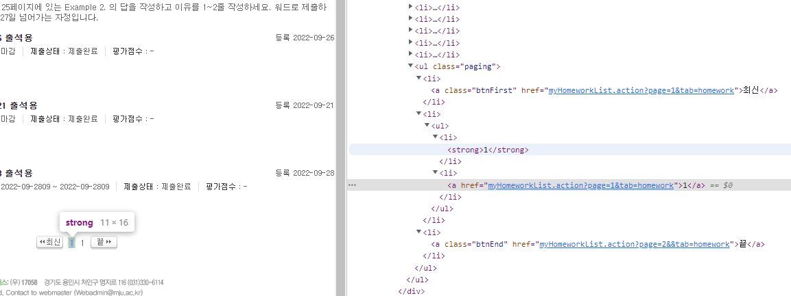

<h1>Homework Control</h1>

<h4>e-class 과제가 알림도 없고 해서 crwaling 활용해서 긁어오는 폼 만들꺼임</h4>

<h3>2022.09.27(화)</h3>
    <h4>문제 상황 발생</h4>
    <h5># TODO 1: 내 강의실 있는 li 먼저 sort 해서 "과제 등록 현황"일 때 크롤링 해야함  
     # TODO 2: "과제 등록 현황"에서는 과제 제출 마감시간을 알 수 없는 문제 발생</h5>

<h3>2022.09.28(수) -16시 58분 수정-</h3>
    <h4>개선 사항</h4>
    <h5>1. alert 폴더와 crawling 폴더를 따로 만듬</h5>
    <h5>2. 마감시간을 긁어오기 위한 deadline_homework.py 생성</h5> 
<h4>홈페이지 오류 발견</h4>

<h4>완료 사항</h4>    
    <h5>1. </h5>

